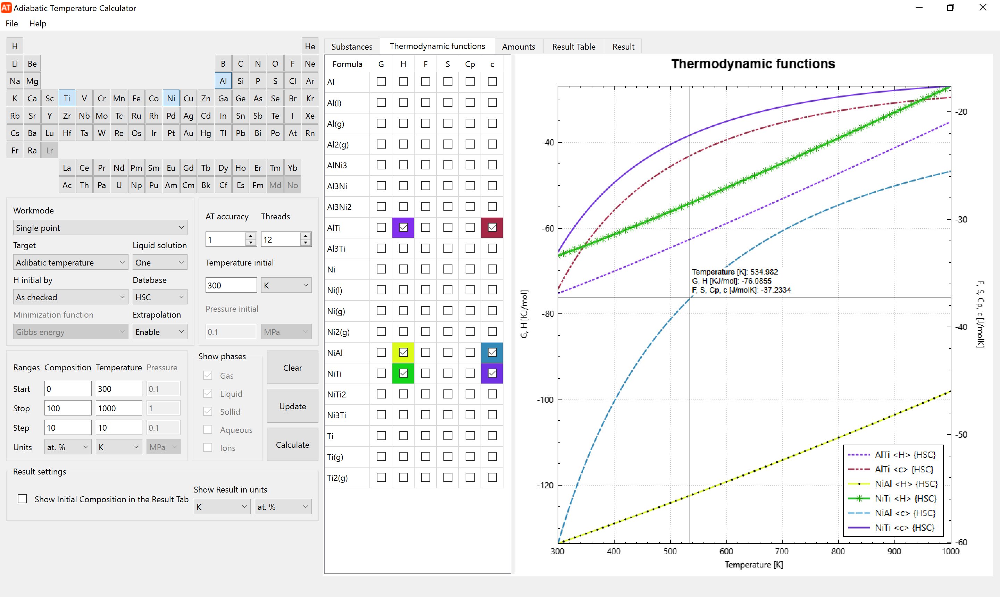
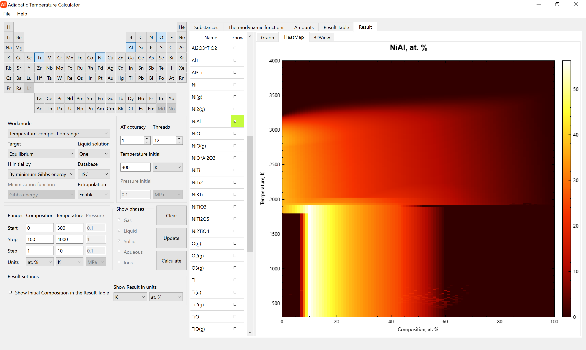

#  __ATC - Adiabatic Temperature Calculator__

## __Description__

ATC is a high quality, visual, open source tool for thermodynamic calculations and visualization of phase diagrams.

The presentation with detailed description and examples is available in [docs/PresentationATC.pdf](docs/PresentationATC.pdf) or via the [link](https://drive.google.com/file/d/1X3msoFNGsCIopT3qIVzpQNqci6pdvrWE/view?usp=share_link).

## __Requirements__

Windows 7 and above or Linux.

## __Features and detailed description__

## Target
ATC has 2 calculation target: Adiabatic temperature and Equilibrium.

__Equilibrium composition__ of the system at a given temperature. The problem of determining the equilibrium composition of the system at the temperature $T$ is reduced to minimizing the following function

$$
G=\sum\limits_{i}^{N}n_i\left( G_i + RT\ln{\frac{n_i}{\sum\limits_{i}^{N}n_i}} \right) + \sum\limits_{i}^{L}n_i\left( G_i + RT\ln{\frac{n_i}{\sum\limits_{i}^{L}n_i}} \right) + \sum\limits_{i}^{K}n_iG_i
$$

with $J$ constraints

$$
\sum\limits_{i}^{N}a_{ji}n_i + \sum\limits_{i}^{L}a_{ji}n_i + \sum\limits_{i}^{K}a_{ji}n_i = b_j
$$

where

$b_j$ - amount of element $j$ in the system,

$J$ - number of elements in the system,

$N$ - number of gases in the system,

$L$ - number of liquids in the system,

$K$ - number of individual condensed substances in the system,

$n_i$ - amount of the substance $i$ in the system,

$G_i$ - Gibbs energy of the substance $i$ in the system,

$a_{ji}$ - amount of element $j$ in the substance $i$.

To minimize the Gibbs energy function, the following methods are used:

* Augmented Lagrangian method
* Sequential Quadratic Programming

Optimization of the objective function is performed using the [NLopt](http://github.com/stevengj/nlopt) library.

__Adiabatic temperature__ of the system with given initial temperature. In this case, a search is performed for the temperature at which the enthalpy of the equilibrium system is equal to the enthalpy of the initial given system in temperature diapason from 298.15 to 10000 K. The initial enthalpy of the system is calculated either in accordance with a given composition (as checked), or with a choice of substances having a lower Gibbs energy value with the same composition (by minimum Gibbs energy). This is set in the H field. For example, if the initial temperature of the system is 500 K and 1 mol of H2O(l) is set, then _"as checked"_ literaly means 1 mol of liquid water at 500 K, and _"by minimum Gibbs energy"_ means that H2O(g) will be automatically selected instead of H2O(l). As a result of the calculation, you will also get the composition of the equilibrium system at adiabatic temperature.

## Workmodes

ATC has 4 calculation workmodes:
1. Single point
2. Temperature range
3. Composition range
4. Temperature-composition range

For _Single point_ and _Composition range_ workmodes the initial temperature of the system is set in the _Temperature initial_ field. For _Temperature range_ and _Temperature-composition range_ workmodes the initial temperature (range, step and units) of the system is set in the _Temperature range_ field.

### __Tabulate the thermodynamic functions for substances from two different databases__

ATC allows you to tabulate the following thermodynamic functions:
* $G$ - Gibbs energy $\left[\frac{kJ}{mol}\right]$
* $H$ - Enthalpy $\left[\frac{kJ}{mol}\right]$
* $F$ - Free Enthalpy Function (FEF) $\left[\frac{J}{mol \thinspace K}\right]$
* $S$ - Entropy $\left[\frac{J}{mol \thinspace K}\right]$
* $C_p$ - Heat capacity at constant pressure $\left[\frac{J}{mol \thinspace K}\right]$
* $c$ - reduced Gibbs energy $\left[\frac{G}{RT}\right]$

The left table shows the substances present in the selected database. The upper right table shows the temperature ranges of the coefficients of the thermodynamic function. The tabulated values of thermodynamic functions in the specified temperature range are presented in the lower right table. The database can be selected in the _Database_ field. The range, step and units of temperature (Kelvin, Celsius and Fahrenheit) can be set in the _Ranges Temperature_ field. Extrapolation can be enabled or disabled in _Extrapolation_ field. After setting the values, click _Update_ button. More detailed information about databases can be found at [docs/databases.md](docs/databases.md)

[](images/screenshots/substances_1.png?raw=true)

### __Plot thermodynamic functions for substances from the database__

Plotting graphs for the above thermodynamic functions.

[](images/screenshots/graphs_1.png?raw=true)

### __Calculating composition of two component system__

The system consists of two parts: the main (green column) and variable (red column). You can set the composition separately for each of them in moles or grams, as well as for the sum values. You can exclude a substances from the calculation by unchecking the _Included_ column. In the workmodes _Single point_ and _Temperature range_, the calculation is for the total system. In workmodes _Composition range_ and _Temperature-composition range_, the variable part of the system varies according to the range, step and unit of measurement in the _Composition range_ field.

[](images/screenshots/amounts_1.png?raw=true)

### __Result of calculation__

When the initial composition of the system is set, click the "Calculate" button. The calculation results will appear on the _Result table_ tab. For the _range_ workmodes you can plot graphs on the _Result_ tab. You can show initial composition of the system instead of result by checking _Show Initial Composition in the Result Table_ checkbox and then click _Update_ button.

__Table example__

[](images/screenshots/result_1.png?raw=true)

__Plot example__

[](images/screenshots/result_2.png?raw=true)

__Heatmap example__

[](images/screenshots/result_3.png?raw=true)

__3D plot example__

[](images/screenshots/result_4.png?raw=true)


## Compiling

+ Clone project by git

	```shell
	git clone git@github.com:alexonemore/atc.git
	```

+ Compiling on Windows by MSVC or MinGW
	+ Install Qt 6.4.2 library (or later Qt6 version)
	+ Install Visual Studio that contains latest MSVC compiler
	+ Put your databases files in databases directory
	+ Run the appropriate release script from the build directory

+ Compiling on Linux
	+ Install qt6 libraries, gcc compiler, cmake
	+ Run the appropriate script from the build directory

## License

ATC is licensed under the GNU General Public License Version 3.
Modification or redistribution is permitted under the conditions of these license.

Copyright © 2022-2023 Alexandr Shchukin

See the subdirectories for the authors of the original libraries utilized by ATC.

